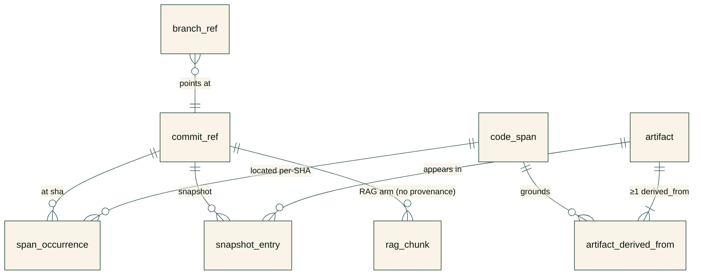
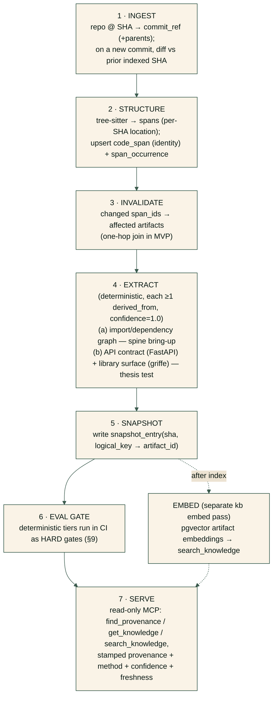

# knowbase — Design

> Status: **agreed MVP design**, implemented through **v0.8**. This document is the source of truth
> for the architecture. It supersedes the original free-form spec. Load-bearing decisions that are
> expensive to change later are marked **[LOCKED]**; everything else is revisable. The MVP vertical
> slice in §8 has shipped (provenance spine, import + FastAPI + domain-entity + library-surface
> + event-handler + call-graph extractors plus the grounded process-path builder over them — with
> cross-file grounding, the sandboxed openapi and griffe oracles, the read-only MCP server, pgvector
> embeddings/search, the RAG A/B gate plus a nightly LLM-judged A/B, LLM-grounded descriptions
> through the whole-repo overview and process-path labels, incremental re-index, and published
> Docker images); items still labelled *deferred* below remain so.

---

## 1. Vision & non-goals

**knowbase** turns a git repository into a **versioned, provenance-grounded Knowledge Layer**
served to humans and AI agents (via MCP). It is *not* RAG-over-code and *not* an AI code
generator.

The product value is **not** in embeddings, OpenAI/Anthropic, or any vector DB — those are
**replaceable adapters**. The value is:

1. Automatically **extracting durable knowledge** from a codebase.
2. Keeping it **current** relative to git history.
3. **Versioning** knowledge per commit/branch.
4. **Serving** it to people and AI with provenance and trust metadata.

**The one risk that matters:** learning to *stably extract useful knowledge* instead of
generating a large volume of useless AI documentation. The architecture below is organized
around de-risking exactly this, not around building the perfect storage layer first.

### Non-goals (MVP)
- Multi-language analysis (Python only for now).
- Multi-provider LLM/embedding abstraction beyond a thin replaceable adapter.
- A separate graph database, a 3-system storage triad, PR-scoped knowledge spaces, and a
  branch-inheritance *protocol* (replaced by content-addressing — see §6).

---

## 2. Locked decisions

| # | Decision | Status |
|---|----------|--------|
| D1 | **Core language: Python** (daemon, CLI, MCP server, orchestration). | [LOCKED] |
| D2 | **First analyzed language: Python.** First targets: **web/API services + libraries/SDK**. | [LOCKED] |
| D3 | **Reuse** existing code-intelligence (tree-sitter now; SCIP/scip-python deferred behind an interface). **Do not hand-write AST analyzers.** | [LOCKED] |
| D4 | **De-risk extraction quality first.** Provenance spine + deterministic extractors + eval before any infrastructure build-out. | [LOCKED] |
| D5 | **Provenance spine is the core invariant:** no knowledge unit is stored unless it is bound to ≥1 exact code span. | [LOCKED] |
| D6 | **Span identity ≠ span location** (see §5). Identity is structural + symbol-path based and excludes `file_path`; byte/line offsets are stored **per occurrence (per-SHA)**. | [LOCKED] |
| D7 | **Single PostgreSQL** store. No separate graph DB; the invalidation DAG is shallow and handled with edge tables (+ recursive CTE once the semantic layer exists). | [LOCKED] |

---

## 3. Core principle: the provenance spine

One data structure closes three requirements at once:

> **Provenance graph** — every knowledge artifact is bound to the exact code spans it was
> derived from, with extraction method and confidence.

It gives us, from a single mechanism:

- **Anti-hallucination** — an artifact that cannot be grounded in ≥1 span is *not stored*.
  This is the line between knowledge and hallucination. Enforced at write time.
- **Incremental update** — a diff maps to changed spans → we invalidate exactly the artifacts
  derived from them (transitively, once artifact→artifact edges exist).
- **Consumer trust** — MCP returns `{knowledge, source_spans@sha, method, confidence,
  freshness}`, so an agent can weigh deterministic facts against LLM summaries.

---

## 4. Knowledge tiers (by extraction method, not by category)

Categories differ by *orders of magnitude* in extraction difficulty and ground-truth
availability. We tier by **method**, and we build strictly bottom-up.

| Knowledge | Method | LLM? | Trust | Ground truth |
|-----------|--------|------|-------|--------------|
| API contracts (web routes / lib public surface) | parse routes / framework openapi / griffe | no | high | **exact & free** (`app.openapi()`, public interface) |
| Domain entities | AST (pydantic/SQLAlchemy/dataclass) | no | high | high |
| Dependency graph | tree-sitter imports + grimp resolution | no | high | hand-labeled + dynamic-import fixtures |
| Architecture | abstraction over call graph | partial | medium | partial |
| **Business processes** | call-graph trace + grounded labeling | yes | low | sub-property gates only (§9) |
| **ADRs** | git/PR history mining (NOT from code) | yes | low | sub-property gates only (§9) |

Two reframings carried from review:

- **ADRs are not extractable from code.** Code shows "we use Kafka now", not "we switched
  because RabbitMQ couldn't handle load". ADR candidates are mined from git history + commit
  messages + PR descriptions. Separate pipeline — **local commit history shipped (slice 1,
  `kb mine`); PR-description mining deferred** (needs a network adapter; `kb.git` stays local).
  The D5 grounding bridge: a `decision` artifact is grounded on the spans its source commit
  **changed** (present at the commit, absent at its first parent — the commit's diff is the
  decision's footprint in code), so even prose-born knowledge points at exact code spans. The
  commit message is stored *verbatim* in the payload as a fact — it is immutable and pinned by
  the sha in the logical key (`decision:{sha}`), but it is context, never grounding. Claims pass
  the same deterministic `validate_claims` floor as `kb describe` (a claim must cite an
  identifier of the *changed* code); a commit with no surviving claim stores nothing.
- **A business process is a *named real path*, never free generation.** Statically trace the
  call graph from an entrypoint to side-effecting sinks; the LLM may only *name/summarize a
  path already materialized in the provenance graph*. A deterministic validator drops any
  claim citing spans/symbols/effects not on the path. If it can't be grounded, it isn't stored.

---

## 5. Span identity vs. location  **[LOCKED — D6]**

This is the single most expensive-to-change decision (the canonical serializer must be locked
before any extractor writes data). Review found a fatal contradiction in the naive version
(hash on normalized text *and* `file_path`, while reporting exact byte ranges that shift per
commit and break on file moves). Resolution:

### What a span *is* (granularity)
A span corresponds to a **named, symbol-bearing tree-sitter node**: module, class,
function/method, and **import statements** (a dedicated span kind). Not per-line, not
whole-file. Imports get their own span kind so the dependency extractor can ground each edge.

### Identity (content-addressed, location-free)
```
span_id = sha256(
    normalization_version ||      # lets the rule evolve safely
    lang ||
    span_kind ||                  # module | class | function | import | ...
    fq_symbol_path ||             # fully-qualified from package root, e.g. "shop.orders.OrderService.create"
    structural_fingerprint        # tree-sitter node normalized (whitespace/comments stripped)
)
```
- **`file_path` is NOT in identity.** Moving a file keeps identity stable as long as the
  fully-qualified symbol path is stable → cross-branch dedup survives refactors.
- **Reformatting** changes neither `fq_symbol_path` nor `structural_fingerprint` → identity
  stable → no spurious invalidation cascade.
- **Renaming a symbol** *does* change identity — semantically it is a change. Snapshot-diff
  continuity across renames is a separate concern handled by `logical_key` rename tracking
  (designed in §6, deferred in build).

### Location (per occurrence, per-SHA)
Offsets/line numbers and the raw text live on `span_occurrence(span_id, sha, …)` and are
**re-resolved on every commit**, even when `span_id` is unchanged. This is what makes "dedup"
and "exact `file:line@sha` provenance" both correct simultaneously.

---

## 6. Versioning & content-addressing

### Artifact identity
```
artifact_id = sha256(
    artifact_id_version ||            # bumped when THIS rule changes (mirror of NORMALIZATION_VERSION)
    canonical(sorted derived_from span_ids) ||
    logical_key ||                    # rule v2 (bug-fix): distinct units may share their entire span set
    extractor_id || extractor_version ||
    prompt_version ||                 # '' for deterministic extractors
    model_id ||                       # '' for deterministic; REQUIRED for llm_grounded  ← review fix
    framework_versions_subset         # only for extractors whose output depends on it (API/entity), NOT imports
)
```
- **Rule v2 (`ARTIFACT_ID_VERSION = 2`)**: `logical_key` joined the hash. v1 derived identity from
  spans + extractor only, so two DIFFERENT artifacts of one extractor sharing their whole evidence
  set — mutually referencing entities (`Order ↔ LineItem`), stacked registrations, mutually
  recursive callers — silently collided into one digest and the second payload was lost on write.
  Same-input reproducibility and cross-branch dedup are unaffected (same key + same spans ⇒ same id).
- Identical inputs on **any** branch/commit collapse to the **same** `artifact_id` → free
  dedup and free "branch inheritance" without an inheritance protocol. An unchanged span on a
  new branch re-hashes to the existing artifact and is simply **re-pointed**, never recomputed
  and never re-LLM'd.
- **`model_id` is in the key for LLM artifacts** — otherwise a model swap (same prompt)
  silently reuses stale labels.
- **`framework_versions` is in the key only where output depends on it** (FastAPI/entity
  extractors), **not** for the import graph (which doesn't depend on fastapi/pydantic versions).

### Snapshots
A snapshot is a git-tree-like manifest: `snapshot_entry(sha, logical_key → artifact_id)`.
`logical_key` is the stable human identity per kind (`api:GET /orders`, `entity:shop.Order`,
`import:shop.orders→shop.billing`). Two commits map the same logical thing to different
`artifact_id` versions; unchanged units keep the same id.

> **Open seam — `logical_key` rename tracking:** who mints `logical_key` and how it survives a
> route/class/function rename. Without it, snapshot diffs become churn ("everything
> deleted+added"). Designed here, **deferred** in build (single-SHA MVP doesn't exercise it).

### Incremental invalidation
`git diff` → changed `span_id`s → join `artifact_derived_from` → affected artifacts re-extract
for the new SHA. Artifacts whose inputs didn't actually change re-hash to an existing row and
are re-pointed with zero recompute. In the MVP the DAG is **one hop** (span → artifact), so a
plain join suffices; the recursive-CTE UP-walk over `artifact_depends_on` arrives **with the
semantic layer** (deferred).

### Schema (current)

Eight tables. The load-bearing edge is `artifact ||--|{ artifact_derived_from` — *one-or-more*, the
≥ 1-grounding invariant in cardinality form. Location lives per-SHA in `span_occurrence`; `rag_chunk`
is the deliberately separate RAG baseline arm (raw source windows, no provenance).



`artifact` additionally carries the derived `embedding vector(384)` + `embedding_model_id` columns
(not part of the content-addressed `artifact_id`; recomputable from payload + model).

---

## 7. Pipeline



`[deferred]` recursive (artifact→artifact) invalidation. ADR mining (slice 1) has since shipped as
`kb mine` — a separate key-gated pass beside `kb describe`, walking indexed first-parent history
and grounding each decision on its commit's changed spans. `kb watch` is the live
trigger over the incremental core: poll a LOCAL branch ref (no network/credentials) → index each
new first-parent commit incrementally → advance the `branch_ref` cursor per commit (crash-safe
resume; force-push/`--max-catchup` degrade to one explicit-parent index of the head). (EMBED + `search_knowledge` and
the runtime openapi oracle shipped in v0.2; the oracle stays eval-only. The LLM-grounded SEMANTIC
EXTRACT — `kb describe` — and **diff-based incremental re-index** have since shipped: `index_commit`
can reuse the spans of files unchanged since an already-indexed parent and parse only the diff, with
extraction still run fully so the snapshot is identical to a full re-index — `INVALIDATE` is now wired
into the index path, not just the invalidation query.)

---

## 8. MVP scope — the first vertical slice

**Goal:** prove *durably-extracted knowledge > RAG* on a question RAG actually fumbles, while
exercising the provenance discipline end-to-end. (Review caveat: the import graph alone proves
the *plumbing*, not the thesis — `what depends on X` is answered exactly by grep/grimp/an IDE.
So the import graph is the **spine bring-up**, and the **API contract** is the honest thesis
test.)

### In scope
- tree-sitter structural layer → content-addressed spans (identity §5, location per-SHA).
- **(a)** Import/dependency extractor: spans from tree-sitter, edge resolution via grimp.
- **(b)** API-contract extractor: **FastAPI** routes (route → handler → params/response),
  grounded **across files**, scored against `app.openapi()` (free exact oracle).
- **(c)** Library public-API-surface extractor *(shipped)*: one `public_symbol` per name a package
  exposes from its `__init__.py` (`__all__`-authoritative; `__init__` re-exports resolved
  **cross-file** to the defining function/class). Extractor is tree-sitter-static (never imports
  user code); scored against **griffe** as a dev-only independent static oracle (never on `index`).
- **(d)** Event-handler extractor *(shipped)*: one `event_handler` per handler carrying decorator
  registrations — pydantic `@field_validator`/`@model_validator`, FastAPI `@app.on_event`,
  SQLAlchemy `@event.listens_for` — AND module-level call-form `event.listen(Target, "e", fn)`
  registrations (family `sqlalchemy_listen`; `fn` resolved same-module or via the calls.py import
  tables — the handler may live in another module than the listen; grounded additionally on the
  registering file's module span, role `registration_site`). Stacked decorators and call sites
  aggregate in `payload.registrations`; one artifact per handler. Grounded on the handler span +
  cross-file on the listened-to class; hand-labeled Tier-1 gate incl. a three-file provenance case
  (handler + target class + registration site). Known gaps (asserted): `listen(...)` inside a
  function/class body (conditional), lambda/attribute `fn`, the bare
  `from sqlalchemy.event import listen` form, lifespan, pydantic-v1, dynamic names.
- **(e)** Call-graph edge extractor *(shipped)*: one `call_edge` per RESOLVED caller→callee pair,
  three deterministic tiers (same-module; imported — **cross-file**; `self.` method of the same
  class); precision-first — only first-party-resolved edges are emitted, recall bounded by
  documented gaps (dynamic/attribute calls, inheritance); grounded on caller + callee def spans;
  hand-labeled Tier-1 gate incl. a mutual-recursion identity-v2 regression. The deterministic
  foundation for §14 item 2.
- Single Postgres with the `≥1 derived_from` invariant enforced at write.
- **Adversarial fixture:** an ungrounded artifact that the write-time check **must reject** —
  so the anti-hallucination discipline is tested in the MVP, not deferred with the LLM.
- Read-only MCP — `find_provenance(file:line@sha)` and `get_knowledge(target, token_budget)` (the MVP
  pair), plus `search_knowledge(query, k, token_budget)` added in v0.2 once pgvector ranking existed.
- Eval Tier-1 (import + API oracles) and Tier-4 (one-hop invalidation set-equality) as CI gates.
- A frozen, documented **pgvector-RAG baseline** + a small fixed question set for the first
  honest A/B (cross-file contract questions).

### Deferred (NOT in the first migration / first code)
`artifact_depends_on` + recursive UP-walk + CYCLE clause; pgvector/HNSW + embeddings + the
EMBED stage; tsvector/`pg_search`/BM25/RRF; snapshot Merkle-root; the runtime `app.openapi()`
sandbox oracle (eval-only, later milestone — it executes user code); the grounded
business-process/LLM layer (call-graph slicing, sink registry, labeler, validator); ADR mining
(slice 1 since shipped — `kb mine`; PR mining still deferred);
multi-branch dedup, mutable branch pointers exercise; eval Tiers 2/3 (build when the artifacts
they score exist; stub the Tier-3 question schema now); GC; SCIP/scip-python upgrade.

---

## 9. Eval harness

Eval is **co-equal with extraction**, weighted to cheap/exact tiers that gate CI from week 1.

- **Tier 1 — deterministic self-checking (HARD GATE).**
  - *Imports:* extracted edges vs a **hand-labeled fixture import list** + a deliberate
    **dynamic-import fixture**. (Note: grimp and `importlib.find_spec` share import-resolution
    machinery and are **not independent oracles** — the hand-labeled fixture is the real
    oracle; the grimp-vs-importlib cross-check only catches consumer bugs.)
  - *API contract:* extracted routes/params/schemas vs `app.openapi()` / `get_openapi(
    routes=app.routes)`, compared **$ref-resolved, order-insensitive**, encoding the oracle's
    documented blind spots (Mount sub-apps, WebSocket, `include_in_schema=False`).
  - *Library surface:* extracted public-API surface vs **griffe** (an INDEPENDENT static engine,
    dev-only) — `__all__`-authoritative, `__init__` re-exports resolved cross-file; canonicalized to
    the top package's functions/classes (Scope A), with third-party / dynamic-`__all__` re-exports
    grounded-but-flagged as known gaps. Entities use a hand-labeled oracle (no independent one
    exists); the library surface has griffe, so the gate is independent like the API one.
- **Tier 4 — incremental-invalidation regression (HARD GATE).** Per SHA-pair, assert
  `invalidated_set == expected` exactly (over-invalidation *and* stale-survival both fail).
  Separate *version-bump* invalidation (full) from *content-diff* invalidation (minimal).
- **Incremental re-index equivalence (HARD GATE).** An incremental re-index (reuse unchanged files'
  spans from the parent snapshot, parse only the diff) must yield the *identical*
  `{logical_key: artifact_id}` snapshot as a full re-index of the same tree — verified across two
  distinct SHAs in one database (artifact ids are content-addressed) — and must provably skip the
  parse for unchanged files (`parsed_files`/`reused_files` counters). A missing/unindexed parent or a
  first-party-root change falls back to a full index.
- **Tier 2 — golden curated repos (TRACKED, non-gating).** 3–5 SHA-pinned permissive Python
  repos; one **held out** and never used for tuning (the real trust signal). Report per-repo,
  never just the mean.
- **Tier 3 — downstream vs RAG (TRACKED, after MCP).** Fixed question set; coding agent
  answers with knowbase-MCP vs a **frozen, peer-reviewed** pgvector-RAG baseline (same
  Postgres, same model). **Pre-register the win threshold.** Metrics: grounded-answer accuracy,
  hallucination rate (claims with no provenance), tokens-to-answer, tool round-trips.
  *Implemented:* the deterministic cross-file recall gate (`tier3_rag_test`, HARD) plus an optional,
  key-gated, NON-gating **LLM-judged A/B** (`kb.llm` + `tier3_llm_judge_test`, run nightly): an answerer
  answers each question from knowbase context vs RAG context, and a judge scores accuracy against
  hand-written gold + hallucination, comparing to a pre-registered threshold (printed, never asserted).

**Invariants asserted as exact ground truth every run:** every artifact has ≥1 `derived_from`
row (zero orphans); re-running an extractor on the same span identity+version yields an
identical `artifact_id` (reproducibility). For the semantic layer (later): 100% of stored LLM
claims survive independent span re-validation, and adversarially-injected ungrounded steps are
rejected. **Verbalized LLM confidence is never used as the score.**

> **Semantic-layer hard floor (review fix):** the thesis-bearing semantic extractor must have a
> *deterministic sub-property gate*, not only subjective Tier-2/LLM-judge: every claimed sink
> in a process summary is a real sink-registry match on the path; path endpoints are real
> entrypoints/sinks. Confidence must honestly count *unknown-unknowns* (edges never discovered
> by the ~70%-recall call-graph engine), not only "unresolved on the path it found".
>
> *Implemented:* the `kb describe` describer enforces this floor —
> `kb.extract.semantic.grounding.validate_claims` drops any claim whose cited symbol is absent from
> the target's grounding spans; a target with no surviving claim is not stored. It covers
> `api_route`/`entity`/`event_handler` artifacts, **per-module (file) descriptions**,
> **per-package architecture overviews** (a package is grounded on its own and its direct-child
> modules' spans; the overview synthesizes the import graph + public surface + member-module
> summaries as *context*, but claims still validate against code spans, so provenance stays
> code-grounded), and the **whole-repo overview** (one `desc:repo` per snapshot, grounded on the
> bounded top-level surface — top-level modules plus each top package's own bounded set,
> `queries.repo_target`; it runs under its OWN system prompt that demands synthesis of the
> just-written package/module summaries — the repo's substance lives in those facts, not in its
> mostly-empty top-level spans — with a per-span body cap so no single large top file can
> monopolize the prompt, while claims still validate against the grounding spans). The gate is deterministic, so `semantic_grounding_test` enforces it in CI (stub LLM, no
> API key), including an adversarial fabricated claim that must be dropped — on the artifact,
> module, package, event-handler, and repo paths — and a bounded-grounding proof (a grandchild
> module never grounds the repo overview).
>
> *Implemented (deterministic process slice):* `process_path` artifacts satisfy the floor **by
> construction** — every sink claim IS a registry match on the materialized path and every endpoint
> IS an extracted entrypoint. Their `confidence` is 1.0: a found path is machine-checked exact (the
> `call_edge` precedent); the unknown-unknowns of the bounded-recall call graph are priced into the
> LLM-labeled process artifact (confidence < 1.0 there), with incompleteness carried as
> explicit payload facts here, never a fudged scalar.
>
> *Implemented (LLM labeling):* `kb describe` now labels each `process_path` as a fourth describe
> slice — the label's claims validate against the path's own spans (fabricated claims dropped; a
> path with no surviving claim stores nothing), and the stored description ships with
> `confidence = kept / (kept + dropped + 1)` — Laplace add-one: the +1 prices unknown-unknowns,
> so an llm_grounded artifact stays < 1.0 **by construction** even when a disciplined model
> fabricates nothing (dogfooding showed the plain ratio degenerating to 1.0 across the board);
> 1.0 remains reserved for the deterministic layer. Gated in
> `semantic_grounding_test` on the stub LLM (no API key), adversarial fabricated claim included.
>
> *Implemented (ADR mining, slice 1):* `kb mine` reuses the same floor for history-born knowledge —
> a `decision` artifact's claims validate against the spans its source commit changed (§4's D5
> bridge), so a fabricated symbol dies deterministically and a commit whose changed code carries no
> cited identifier stores nothing. `confidence = kept / (kept + dropped + 1)` (Laplace add-one,
> as above), counted, never verbalized; trust stays LOW (§4). Merge commits are skipped (their prose belongs to the PR
> slice), docs-only commits never pay an LLM call, a root commit is mined against the empty tree,
> and an oversized grounding set is capped with a retro-flag (`grounding_capped` +
> `total_changed_spans`) — bounded, never silent. Re-mining skips stored decisions (LLM-cost
> idempotency); no-decision commits are re-asked on purpose — a "nothing here" marker would itself
> be an ungrounded artifact, which D5 forbids. Gated in `adr_mining_test` (stub LLM, no API key).

---

## 10. MCP serving

Read-only in the MVP. The interesting part is the **query shape** ("give knowledge relevant to
this target within a token budget"), not the transport. Every response unit **always** carries
`provenance(file:line@sha) + extraction_method(deterministic|llm_grounded) + confidence +
freshness(current|stale@sha)`, with a deterministic tie-break for reproducible eval.

- Shipped tools: `find_provenance`, `get_knowledge` (budget-trimmed, ranked), and `search_knowledge`
  (cosine-ranked over pgvector embeddings; added v0.2 — see §9 Tier-3).
- Deferred: `expand_knowledge`, write/mutation tools, auth/multi-tenant, async tasks, subscriptions.

> **Freshness semantics (open):** one `artifact_id` legitimately appears in many snapshots, so
> "the unit's provenance SHA" is ambiguous. Freshness must be defined per-snapshot (or via
> per-SHA span occurrence), and likely precomputed per commit to avoid an O(repo) query.

---

## 11. Module layout

| Module | Responsibility | Key tech |
|--------|----------------|----------|
| `kb.structural` | Parse Python without executing it; enumerate symbols/imports/call-sites with per-SHA byte/line ranges; compute content-addressed span identity; incremental reparse. Hidden behind a `StructuralIndex`/`PathEngine` interface so a SCIP backend can replace tree-sitter later. | tree-sitter + tree-sitter-python (canonical bindings) |
| `kb.extract.deterministic` | No-LLM extractors → exact artifacts (confidence=1.0): import graph; FastAPI API contract (static, cross-file grounded); domain entities (pydantic/dataclass/SQLAlchemy, static, cross-file links to referenced entities, hand-labeled gate); library public-API surface (static tree-sitter, cross-file `__init__` re-export resolution, independent griffe-oracle gate); event handlers (pydantic validators / FastAPI `on_event` / SQLAlchemy `listens_for` + module-level call-form `listen`, static, cross-file target + registration-site grounding, hand-labeled gate); call-graph edges (per-edge artifacts, three resolution tiers, caller+callee span grounding, hand-labeled gate); process paths (`paths.PathEngine` — the first shipped increment of the PathEngine seam — BFS to sink-registry matches, multi-file grounded, registry digest identity-bearing). | grimp, tree-sitter queries; griffe (dev-only oracle) |
| `kb.introspect` | Eval-only runtime oracle: runs a FastAPI app in a network-blocked sandbox and emits `app.openapi()` for the Tier-1 API gate. Never on the index path. | subprocess sandbox, fastapi |
| `kb.embed` | Replaceable embedding adapters + snapshot population for `search_knowledge`. Torch isolated behind the `embed` extra and a lazy import. | sentence-transformers (default), OpenAI (optional), pgvector |
| `kb.rag` | Frozen pgvector RAG-over-source baseline — the "other arm" of the knowledge-vs-RAG A/B (no provenance/grounding). | deterministic line-window chunker, pgvector |
| `kb.git` | Ingest commits/branches; diff SHAs → changed byte ranges → changed span_ids. (PR mining deferred.) | pygit2 |
| `kb.store` | Single source of truth: content-addressed spans/artifacts, provenance edges, snapshot manifests. Enforces the ≥1-derived_from invariant at write. | PostgreSQL 17, psycopg 3, SQLAlchemy Core, alembic |
| `kb.eval` | Tiered eval; deterministic tiers gate CI. | pytest over SHA-pinned golden repos |
| `kb.mcp` | Read-only MCP server; provenance-carrying records; budget-aware assembly. | FastMCP (pinned), Pydantic models |
| `kb.daemon` | Orchestration + CLI: index a repo @ SHA (full or incremental), run extractors in order, write snapshot, host MCP; `kb watch` polls a local branch ref and indexes new first-parent commits incrementally (`branch_ref` cursor, per-commit crash-safe advance). | typer |
| `kb.extract.semantic` | **Shipped:** `kb describe` — LLM-grounded NL descriptions of routes/entities/modules, **per-package architecture overviews** (a package grounded on its own + direct-child modules' spans; the overview synthesizes the import graph + public surface + member-module summaries as context, claims code-grounded), **process-path labels** (one per materialized `process_path`, grounded on every span along the path, confidence < 1.0), **event-handler descriptions**, **and the whole-repo overview** (one `desc:repo` per snapshot, grounded on the bounded top-level surface via `queries.repo_target`, synthesizing package summaries + cross-package imports + artifact counts as context), each claim validated against the target's spans by a deterministic sub-property gate (`grounding.validate_claims`); separate key-gated pass, never on `index`. **`kb mine`** — ADR-candidate mining over local first-parent history: one `decision` per mined commit, grounded on the commit's changed spans (role `changed`), message verbatim in the payload, same claim floor. *Deferred:* PR-description mining. | thin LLM adapter (`kb.llm`); `PathEngine` + YAML sink registry live in `kb.extract.deterministic.paths` |

---

## 12. Technology choices — with honest caveats

Review fact-checked these against current (2026) sources. Caveats are first-class.

- **tree-sitter + tree-sitter-python** — mature, fast, error-tolerant, no project setup.
  Syntactic only (no type/reference resolution); raw byte offsets shift on edits → offsets live
  per-occurrence, identity is structural (§5).
- **grimp** (import graph) — Rust-core, queryable. Gives **module-level edges with at most a
  line number, NOT byte spans** → import-statement spans come from **tree-sitter**; grimp is
  used only for **edge resolution**. Needs the first-party package resolvable on `sys.path` →
  *not* "zero setup" for arbitrary repos; the truly zero-setup path is tree-sitter import
  parsing, grimp as an enhanced (env-dependent) resolver.
- **FastAPI `app.openapi()`** — free **exact** oracle for the API contract. Runtime mode
  executes user code → **deferred, eval-only, sandboxed** (subprocess, no network, resource
  limits) or an opt-in `knowbase introspect` the user runs in their own venv. The serving
  extractor is **static** (tree-sitter).
- **griffe** (static) — ready-made library public-API-surface analyzer (signatures, types,
  docstrings) with built-in API-diff. Used as the **dev-only independent oracle** for the
  library-surface Tier-1 gate (`allow_inspection=False` → never executes code); the serving
  extractor is tree-sitter-static and never imports it (mirrors how fastapi powers the openapi
  oracle while the route extractor stays static).
- **PostgreSQL 17** — single store. We avoid Apache AGE because the invalidation DAG is shallow
  (1–4 hops) and a single store is simpler — **not** because of a "~40× faster" figure (that
  number traces to one alpha-era microbenchmark of ~1.86×; **struck**). Recursive CTEs are
  *adequate* for this shape.
- **FastMCP** — chosen on feature set (auth, middleware, structured output, transports). v3.0
  is **very recently released** (was beta in Jan 2026) → **pin `fastmcp>=3.0,<4`** and keep the
  official SDK FastMCP 1.0 as a genuine fallback. (Vendor "powers ~70% of MCP servers /
  ~1M downloads/day" claims are self-reported and **not relied upon**.)
- **scip-python / SCIP** *(deferred)* — the precise cross-reference/typed-edge upgrade, kept
  behind `PathEngine`/`StructuralIndex` (the `symbol_id` column is reserved). Caveat: low
  velocity, small team, no tagged GitHub releases (v0.6.6 is the npm version), needs Node + an
  activated venv, and the Python consumer will likely compile the `.proto` itself. This
  *strengthens* keeping it deferred behind an interface.
- The shipped deterministic `call_edge` extractor takes the tree-sitter-call-sites road: it emits
  **only resolved** edges (precision-first) with recall bounded by documented gaps (dynamic
  dispatch, attribute calls, inheritance) — the "always quote recall, not just precision" rule;
  PyCG-class resolvers stay deferred behind `PathEngine`.
- **PyCG (call graph, deferred semantic layer)** — **archived/unmaintained**; ~99% precision is
  paired with only **~70% recall** (≈30% of real edges missed → "incomplete path" is the common
  case). Treat as a known-temporary default strictly behind `PathEngine`; evaluate maintained
  alternatives (Jarvis, Scalpel, or a tree-sitter-call-sites + scip-python-resolved-refs
  hybrid). **Always quote recall, not just precision.**

---

## 13. Open questions & risks (tracked)

- **Canonical serializer stability** — lock one normalized serializer for span identity; fold
  `normalization_version` into the hash so it can evolve; assert reproducibility as a CI invariant.
- **`logical_key` rename/move tracking** — undesigned; needed before multi-commit snapshot diffs
  are meaningful.
- **Static-analysis ceiling** — dynamic/conditional imports, dynamic route/task registration,
  dynamic dispatch/DI/`getattr`, metaprogramming are invisible. Surface as an explicit
  *incomplete* confidence signal; probe with dedicated fixtures; never imply completeness.
- **Daemon concurrency/transaction model** — commit arriving mid-extraction, partial-snapshot
  visibility to MCP reads, crash recovery mid-snapshot, content-addressed upsert races. Undesigned.
- **Unparseable-file handling** — a syntax error on a branch (common mid-refactor) must be a
  *recorded gap*, not a silent recall loss.
- **Monorepo / namespace-package first-party boundaries** — `src`-layout, multiple top-level
  packages, namespace packages; affects import-extractor correctness directly.
- **Freshness across branches** — see §10.
- **`__init__.py` re-exports / star imports / relative imports** — break the 1:1 "edge → one
  import span" mapping for the very first extractor; needs an explicit story.
- **GC under cross-branch sharing** — one `artifact_id` is referenced by many snapshots; GC needs
  reference counting across **all** retained snapshots + a retention policy. Deferred.

---

## 14. Roadmap (post-MVP, indicative)

1. Second deterministic family: **entities (pydantic/dataclass/SQLAlchemy) — shipped** (static
   tree-sitter, hand-labeled Tier-1 gate); **events — shipped** (decorator registrations for
   pydantic/FastAPI/SQLAlchemy plus module-level call-form `event.listen` — v2, static
   tree-sitter, hand-labeled Tier-1 gate; function-body/lambda/bare-import forms and lifespan
   stay documented gaps).
2. The **one** grounded business-process extractor (named real path + labeler + validator +
   deterministic sub-property gate) — **shipped**: the `call_edge` extractor + Tier-1 calls gate;
   the `process_path` builder (PathEngine BFS + sink registry + `.kb/sinks.yaml` override,
   multi-file grounded paths, Tier-1 processes gate); and the LLM labeler (`kb describe`'s
   `process_path` slice — span validation against the path's own spans IS the binding validator,
   gated in `semantic_grounding_test`).
3. Recursive invalidation (`artifact_depends_on`), multi-branch dedup, freshness precompute.
4. Embeddings + `search_knowledge` *(shipped v0.2)*; then `pg_search`/BM25 + RRF if vector ranking is insufficient.
5. ADR mining from git/PR history — **slice 1 shipped** (`kb mine`: local commit history, decisions
   grounded on the source commit's changed spans, `adr_mining_test` gate); PR-description mining
   deferred (network adapter).
6. SCIP/scip-python precise-reference backend behind `PathEngine`.
7. Scale: GC/retention, read replicas, monorepo boundaries, runtime-oracle sandbox hardening.

---

## 15. Open-source & commercialization (brief)

License: **AGPLv3** (already chosen) — classic open-core posture. Likely model: OSS core
(self-host, single repo) / commercial (hosted, org-wide cross-repo knowledge, PR bot, SSO,
scale). Honest moat note: if extraction quality *is* the value and it's open source, the
defensibility is the **eval/tuning flywheel** (eval sets, tuned prompts/pipelines) + hosted
graph at monorepo scale + integrations — not the code itself.
